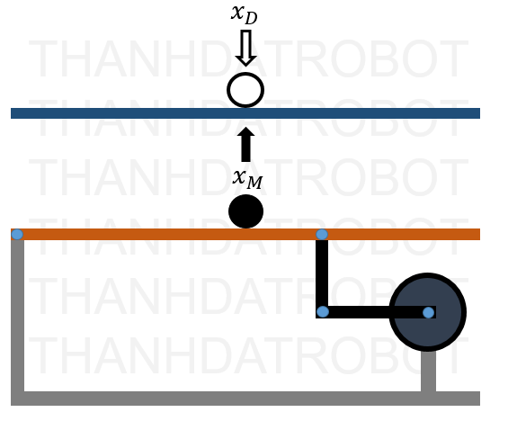
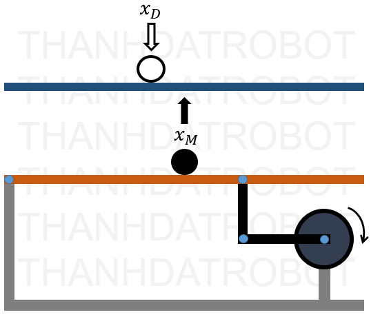
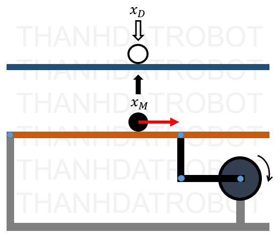
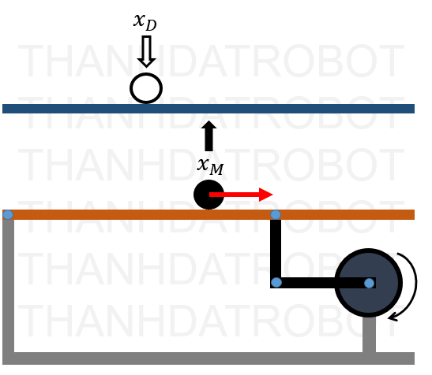
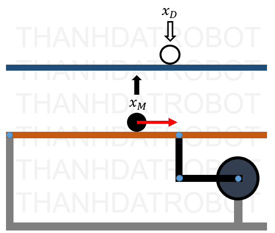

# Control-of-a-Ball-and-Beam-System-using-Fuzzy-Logic

### 1. Example: Fan Speed Control Based on Temperature and Humidity

#### Step 1: Define Input and Output Variables

- **Input 1 (Temperature):**
  - Fuzzy sets:
    - **Low**
    - **Medium**
    - **High**

- **Input 2 (Humidity):**
  - Fuzzy sets:
    - **Low**
    - **Medium**
    - **High**

- **Output (Fan Speed):**
  - Constant values for each fuzzy set of fan speed:
    - **Slow:** 30% fan speed
    - **Medium:** 60% fan speed
    - **Fast:** 90% fan speed

#### Step 2: Define Control Rules

The control rules combine temperature and humidity to determine the fan speed. Here's the updated fuzzy control rule matrix:

| Temperature / Humidity | Low (H)    | Medium (H) | High (H)   |
|------------------------|------------|------------|------------|
| **Low (T)**            | Slow (30%) | Slow (40%) | Medium (50%) |
| **Medium (T)**         | Slow (40%) | Medium (60%)| Fast (70%)  |
| **High (T)**           | Medium (50%)| Fast (70%) | Fast (90%)  |

#### Step 33: Define Membership Functions

Membership functions for temperature and humidity are defined as follows:

- **Temperature:**
  - **Low:** `μ_low(T) = max(0, min(1, (25 - T)/10))`
  - **Medium:** `μ_medium(T) = max(0, min((T - 20)/5, (30 - T)/5))`
  - **High:** `μ_high(T) = max(0, min((T - 25)/5, 1))`

- **Humidity:**
  - **Low:** `μ_low(H) = max(0, min(1, (40 - H)/20))`
  - **Medium:** `μ_medium(H) = max(0, min((H - 30)/10, (70 - H)/20))`
  - **High:** `μ_high(H) = max(0, min((H - 50)/20, 1))`

#### Step 4: Calculate Membership Values for a Given Input

Assume the actual temperature is **28°C** and the humidity is **60%**. The membership values are calculated as follows:

- **Temperature:**
  - `μ_low(28) = 0`
  - `μ_medium(28) = 0.4`
  - `μ_high(28) = 0.6`

- **Humidity:**
  - `μ_low(60) = 0`
  - `μ_medium(60) = 0.5`
  - `μ_high(60) = 0.5`

#### Step 5: Inference Using Max-Prod Method

Based on the updated fuzzy control rule matrix, here are the relevant rules triggered and their corresponding firing strengths:

1. **Rule 5: IF Temperature is Medium AND Humidity is Medium THEN Fan Speed = 60%**
   - Firing strength = `μ_medium(28) * μ_medium(60) = 0.4 * 0.5 = 0.2`
   - Output value = `60%`
   - Activated output = `0.2 * 60 = 12`

2. **Rule 6: IF Temperature is Medium AND Humidity is High THEN Fan Speed = 70%**
   - Firing strength = `μ_medium(28) * μ_high(60) = 0.4 * 0.5 = 0.2`
   - Output value = `70%`
   - Activated output = `0.2 * 70 = 14`

3. **Rule 7: IF Temperature is High AND Humidity is Medium THEN Fan Speed = 70%**
   - Firing strength = `μ_high(28) * μ_medium(60) = 0.6 * 0.5 = 0.3`
   - Output value = `70%`
   - Activated output = `0.3 * 70 = 21`

4. **Rule 8: IF Temperature is High AND Humidity is High THEN Fan Speed = 90%**
   - Firing strength = `μ_high(28) * μ_high(60) = 0.6 * 0.5 = 0.3`
   - Output value = `90%`
   - Activated output = `0.3 * 90 = 27`

#### Step 6: Defuzzification (Weighted Average)

Using the weighted average method, the final fan speed is calculated as follows:

**Fan Speed = (12 + 14 + 21 + 27) / (0.2 + 0.2 + 0.3 + 0.3) = 74 / 1.0 = 74**

#### Result

The final fan speed after inference is **74%**.

This example illustrates a fuzzy control system with two input variables (temperature and humidity) using the **Max-Prod** method for inference and a **Sugeno-type fuzzy controller** with constant outputs. The final output is obtained using the **weighted average method** for defuzzification.

---

### 2. Control of a Ball and Beam System using Fuzzy Logic

#### Fuzzy Logic Control Rules

**Some experiences from the expert**

**When the Ball is at the desired position `xd` (e = ZE), and the Ball has no tendency to move left or right (edot = ZE), the system should maintain this state without changing the Servo angle (theta = ZE).**

**When the Ball deviates slightly to the right of the desired position `xd` (e = NS), and the Ball has no tendency to move left or right (edot = ZE), then the Beam needs to be raised slightly to move the Ball back to `xd`, and the Servo angle should be adjusted slightly (theta = NS).**

**When the Ball is at the desired position `xd` (e = ZE), and the Ball has a tendency to move to the right (edot = NS), then the Beam needs to be raised slightly to keep the Ball at the desired position `xd`, and the Servo angle should be adjusted slightly (theta = NS).**

**When the Ball is deviating to the right of the desired position `xd` (e = NS), and the Ball has a tendency to move to the right (edot = NS), then the Beam needs to be raised to a medium level to move the Ball back to the desired position `xd`, and the Servo angle should be adjusted (theta = NM).**

**When the Ball is deviating to the left of the desired position `xd` (e = PS), and the Ball has a tendency to move to the right (edot = NS), then continue to maintain this state without changing the Servo angle (theta = ZE).**

The table below represents the Fuzzy control rules for the system, based on `e` (error) and `edot` (error derivative). The values of `Theta` are the control outputs.

| edot \ e | NB  | NM  | NS  | ZE  | PS  | PM  | PB  |
|----------|-----|-----|-----|-----|-----|-----|-----|
| **NB**   | NB  | NB  | NM  | NM  | NS  | NS  | ZE  |
| **NM**   | NB  | NM  | NM  | NS  | NS  | ZE  | PS  |
| **NS**   | NM  | NM  | NS  | ZE  | ZEZE  | PS  | PS  |
| **ZE**   | NM  | NS  | NS  | ZE  | PS  | PM  | PM  |
| **PS**   | NS  | NS  | ZE  | PS  | PS  | PM  | PM  |
| **PM**   | NS  | ZE  | PS  | PM  | PM  | PB  | PB  |
| **PB**   | ZE  | PS  | PS  | PM  | PM  | PB  | PB  |

- **e** stands for error (deviation from the desired value)
- **edot** represents the rate of change of the error
- **Theta** is the resulting output based on the Fuzzy logic rules

**Actual model control results**

| n\Setpoint   | 10 | 20 | 30 |
|----------|-------------|-------------|-------------|
| 1 | 10.570      | 19.55       | 31.78       |
| 2 | 9.552       | 20.84       | 31.47       |
| 3 | 10.910      | 20.20       | 32.50       |
| 4 | 9.553       | 21.13       | 30.96       |
| 5 | 8.817       | 22.12       | 30.16       |
| 6 | 8.917       | 20.17       | 30.28       |
| 7 | 10.22       | 20.84       | 31.72       |
